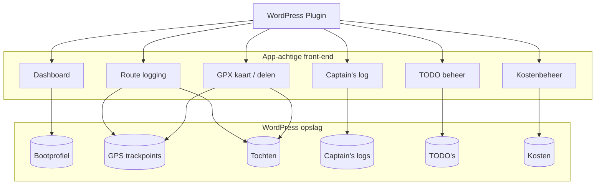

# Functioneel Ontwerp - Phoenix Logboek App

**Plugin:** `bso-phoenix`  
**Versie:** 1.0.0  
**Auteur:** Byteway Software Ontwikkeling  
**Datum:** 3 juli 2026  
**Doelplatform:** WordPress als app-achtige beheeromgeving voor de motorboot Phoenix

---

## Inhoudsopgave

1. [Inleiding en doel](#1-inleiding-en-doel)
2. [Doelgroep en gebruikssituatie](#2-doelgroep-en-gebruikssituatie)
3. [Bootgegevens en beperkingen](#3-bootgegevens-en-beperkingen)
4. [Architectuuroverzicht](#4-architectuuroverzicht)
5. [Bootprofiel](#5-bootprofiel)
6. [GPS route logging](#6-gps-route-logging)
7. [Captain's log en foto’s](#7-captains-log-en-fotos)
8. [GPX kaart en delen](#8-gpx-kaart-en-delen)
9. [TODO beheer](#9-todo-beheer)
10. [Kostenbeheer en inzicht](#10-kostenbeheer-en-inzicht)
11. [Dashboard en realtime status](#11-dashboard-en-realtime-status)
12. [Overzichten en rapportages](#12-overzichten-en-rapportages)
13. [Gebruikersrollen en toegang](#13-gebruikersrollen-en-toegang)
14. [Functionele grenzen en aannames](#14-functionele-grenzen-en-aannames)

---

## 1. Inleiding en doel

De **Phoenix Logboek App** is een WordPress-plugin met een app-achtige front-end voor het vastleggen, analyseren en delen van vaartochten op de motorboot **Phoenix**.

De boot is een zelfgemaakt motorjacht en de plugin is bedoeld als centrale plek voor:

- routevastlegging via GPS
- captain's log per dag
- beheer van onderhoudstaken (TODO's)
- kosteninzicht voor varen en onderhoud
- inzicht in routes, prestaties en brandstofverbruik
- het genereren en delen van GPX-routes

De plugin is bewust ontworpen voor **één boot**. Ondersteuning voor meerdere boten is expliciet buiten scope om de oplossing overzichtelijk en beheersbaar te houden.

### Problemen die de app oplost

Met deze app worden de volgende praktische problemen tijdens en na het varen opgelost:

- makkelijker inschatten hoeveel brandstof er na een vaart over is, zodat op tijd tanken gepland kan worden
- inzicht in kosten tijdens het varen, zowel direct (bijvoorbeeld bruggen) als indirect (bijvoorbeeld gas en water)
- een visuele kaart van de route tijdens het varen en na afloop
- mogelijkheid om routekaarten te delen via download en mail
- taakjes die tijdens het varen opvallen centraal vastleggen op een plek

---

## 2. Doelgroep en gebruikssituatie

De plugin is bedoeld voor:

- de eigenaar van de Phoenix
- personen die aan boord registreren en loggen
- beheerder die onderhoud, routes, kosten en logboekgegevens bijhoudt

Typische gebruikssituaties:

- een tocht starten en de route automatisch laten vastleggen
- na afloop route, duur, afstand en brandstofverbruik terugzien
- per dag een logboeknotitie met foto's toevoegen
- onderhoudsklussen plannen en volgen
- kosten van varen en onderhoud analyseren
- een route delen via mail of downloaden als GPX-bestand

---

## 3. Bootgegevens en beperkingen

De plugin moet de belangrijkste bootgegevens kunnen opslaan en tonen.

### Vast te leggen bootgegevens

| Gegeven | Omschrijving |
|---------|--------------|
| Naam | Phoenix |
| Type | Zelfgemaakt motorjacht |
| Lengte | 7 meter |
| Breedte | 3 meter |
| Diepgang | 80 cm |
| Hoogte | 2,35 meter |
| Motorbrandstof | Diesel |
| Topsnelheid | Ongeveer 8 km/uur |
| Gewicht | Ongeveer 4 ton |

### Functionele beperking

- De plugin ondersteunt standaard **slechts één boot**.
- Meerdere boten worden niet ondersteund.
- Deze beperking voorkomt onnodige complexiteit in routes, logboek, kosten en onderhoud.

### Hoogtebeperking

De boot kan varen onder bruggen tot een hoogte van **2,4 meter**. Deze eigenschap moet zichtbaar zijn in het bootprofiel en kan gebruikt worden in toelichtingen of route-informatie.

---

## 4. Architectuuroverzicht

---

## 5. Bootprofiel

Het bootprofiel vormt de basis van de applicatie.

### Functies

- bootgegevens vastleggen en wijzigen
- huidige technische eigenschappen tonen
- algemene informatie voor dashboards en overzichten beschikbaar maken

### Veldenset

| Veld | Verplicht | Omschrijving |
|------|-----------|--------------|
| Naam boot | Ja | Phoenix |
| Type boot | Ja | Motorjacht |
| Lengte | Ja | 7 meter |
| Breedte | Ja | 3 meter |
| Diepgang | Ja | 80 cm |
| Hoogte | Ja | 2,35 meter |
| Motor | Ja | Diesel |
| Topsnelheid | Ja | 8 km/uur |
| Gewicht | Ja | 4 ton |
| Opmerking brughoogte | Nee | Bijvoorbeeld: geschikt tot 2,4 meter brughoogte |

---

## 6. GPS route logging

De kernfunctie van de app is het automatisch vastleggen van routes via GPS-coördinaten die vanaf mobiel of tablet binnenkomen.

### Functies

- startknop voor het starten van een tocht
- stopknop om route logging te beëindigen
- automatisch vastleggen van GPS-punten tijdens het varen
- totale route opslaan als reeks coördinaten
- totaal van tochtduur en afstand vastleggen
- gemiddelde snelheid berekenen

### Routegedrag

Wanneer de gebruiker op **Start** drukt:

1. een nieuwe tocht wordt aangemaakt
2. datum en tijd worden automatisch vastgelegd
3. GPS-punten worden periodiek opgeslagen
4. de dashboardstatus verandert naar “vaart actief”

Wanneer de gebruiker op **Stop** drukt:

1. de route wordt afgesloten
2. totale duur wordt berekend
3. afstand en gemiddelde snelheid worden berekend
4. brandstofverbruik kan worden afgeleid op basis van het gemiddelde verbruik
5. de tocht wordt opgeslagen als afgerond logboekitem

### Vast te leggen routegegevens

| Gegeven | Omschrijving |
|---------|--------------|
| Starttijd | Automatisch bij start |
| Eindtijd | Automatisch bij stop |
| Duur | Totale vaartijd |
| GPS-punten | Reeks coördinaten van mobiel/tablet |
| Afstand | Totale vaartafstand |
| Gemiddelde snelheid | Berekend in km/uur |
| Brandstofverbruik | Berekening op basis van gemiddeld verbruik |

### Routeweergave

De route moet visueel inzichtelijk zijn in de app, inclusief een live preview tijdens het varen en een volledig overzicht na afloop.

---

## 7. Captain's log en foto’s

De gebruiker kan per dag een captain's log vastleggen.

### Functies

- een tekstlog per dag
- koppeling met route of vaarmoment
- toevoegen van meerdere foto’s aan een log
- datum en tijd automatisch vastleggen

### Beheeracties in admin

- een **Verwijder alles**-actie voor captain's log-items
- verplichte bevestigingsstap voordat alles wordt verwijderd
- duidelijke succes/foutmelding na uitvoering

### Veldenset

| Veld | Omschrijving |
|------|--------------|
| Datum | Automatisch |
| Tijd | Automatisch |
| Tekst | Vrije notitie |
| Foto’s | Meerdere afbeeldingen |
| Koppeling aan tocht | Optioneel |

### Gebruik

De captain's log is bedoeld voor:

- weersomstandigheden
- bijzonderheden tijdens de tocht
- onderhoudsnotities
- herinneringen voor later gebruik

---

## 8. GPX kaart en delen

Op basis van de opgeslagen route moet automatisch een GPX-kaart worden gegenereerd.

### Functies

- route exporteren als GPX-bestand
- kaartvisualisatie op basis van routepunten
- delen via download
- delen via e-mail

### Gebruiksscenario

Na een tocht kan de gebruiker:

1. de route terugzien op een kaart
2. het GPX-bestand downloaden
3. de route per mail delen

### Informatie in GPX-kaart

- volledige route
- start- en stopmoment
- datum van de tocht
- optioneel tempo- of snelheidsinformatie

---

## 9. TODO beheer

In een apart formulier kunnen onderhoudsklussen en andere taken voor de boot worden vastgelegd.

### Functies

- TODO toevoegen
- TODO aanpassen
- status van TODO wijzigen
- prioriteitsindicatie geven
- overzicht van open en afgeronde TODO’s

### Beheeracties in admin

- een **Verwijder alles**-actie voor TODO-items
- verplichte bevestigingsstap voordat alles wordt verwijderd
- duidelijke terugkoppeling over aantal verwijderde taken

### Statussen

De statuswaarden zijn vooraf gedefinieerd.

Voorstel:

| Status | Betekenis |
|--------|-----------|
| Nieuw | Nog niet opgepakt |
| Bezig | Wordt uitgevoerd |
| Wacht op onderdelen | Kan nog niet afgerond worden |
| Gereed | Afgerond |
| Geannuleerd | Niet meer relevant |

### Prioriteit

Elke TODO krijgt een prioriteitsindicatie, bijvoorbeeld:

- laag
- normaal
- hoog
- urgent

### Gebruik

TODO’s kunnen worden gebruikt voor:

- technische klussen aan de boot
- onderhoudstaken
- voorbereidingen voor een nieuwe vaarperiode
- meldingen die later opgepakt moeten worden

---

## 10. Kostenbeheer en inzicht

In een apart formulier kan inzicht worden verkregen in kosten.

### Kosten categorieën

- kosten van varen
- kosten van onderhoud
- kosten van onderhoudsartikelen
- overige kosten

### Functies

- kosten registreren
- kosten rubriceren per categorie
- kosten koppelen aan datum of tocht
- overzichten tonen per periode

### Registratieregel voor meerdere kosten op dezelfde dag

- per datum mogen **meerdere kostenposten van hetzelfde type** worden opgeslagen
- registratie wordt alleen geblokkeerd bij echte dubbele submit (zelfde actie direct opnieuw), niet op basis van type+datum alleen
- overzichten en rapportages tonen alle afzonderlijke kostenregels

### Gebruik

De kostenmodule ondersteunt inzicht in:

- brandstofkosten
- directe vaarkosten (zoals bruggen en sluizen)
- indirecte verbruikskosten (zoals gas en water)
- onderhoudskosten
- materiaalkosten
- totale kosten over een periode

---

## 11. Dashboard en realtime status

Het dashboard is de centrale app-pagina voor de gebruiker.

### Dashboard toont

- of de boot nu vaart of niet
- of een tocht actief is
- live preview van de GPX-kaart
- schakeloptie tussen compacte kaartweergave en schermvullende live view
- waarschuwing wanneer tanken nodig is
- korte samenvatting van de laatste tocht
- bootstatus en basisgegevens

### Tankadvies

De app moet signaleren wanneer tanken waarschijnlijk nodig is op basis van:

- ingevuld gemiddeld verbruik
- resterende brandstofvoorraad
- recente vaartochten

### Realtime gedrag

Wanneer een tocht actief is, moet het dashboard direct laten zien:

- dat logging loopt
- dat GPS-punten worden opgeslagen
- dat de route groeit op de kaart

---

## 12. Overzichten en rapportages

De app moet verschillende samenvattingen kunnen genereren.

### Route overzichten

- hele route
- deel van een route
- route van vandaag

### Informatie per overzicht

- duur
- afstand
- brandstofverbruik
- gemiddelde snelheid

### Rapportagevormen

- lijstweergave
- grafisch overzicht
- kaartweergave
- export of deeloptie

---

## 13. Gebruikersrollen en toegang

### Rollen

| Rol | Rechten |
|-----|---------|
| Beheerder | Alle instellingen, routes, kosten en logs beheren |
| Schipper / gebruiker | Starten, stoppen, loggen, TODO’s beheren, kosten invoeren |
| Lezer | Dashboard en overzichten bekijken |

### Toegangsregels

- één beheerder kan het bootprofiel beheren
- alleen bevoegde gebruikers mogen GPS-logging starten en stoppen
- leesrechten kunnen breder worden gedeeld

---

## 14. Functionele grenzen en aannames

### Grenzen

- de plugin ondersteunt standaard slechts **één boot**
- meerdere boten zijn buiten scope
- de route wordt vastgelegd via GPS van mobiel of tablet
- de app is gekoppeld aan WordPress en draait binnen die omgeving

### Aannames

- de gebruiker heeft een mobiel of tablet met GPS
- de gebruiker geeft eventueel een gemiddeld brandstofverbruik op
- de app heeft toegang tot datum, tijd en locatiegegevens
- foto's worden via mobiele of tabletinterface toegevoegd

---

## Slot

De Phoenix Logboek App combineert routevastlegging, logboek, onderhoud, kostenbeheer en een app-achtige dashboardervaring in één WordPress-plugin. De oplossing is gericht op één boot, zodat de ervaring eenvoudig, overzichtelijk en praktisch blijft.

