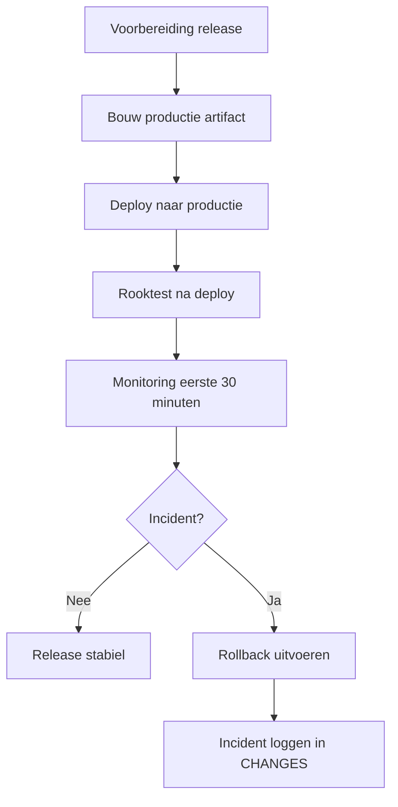
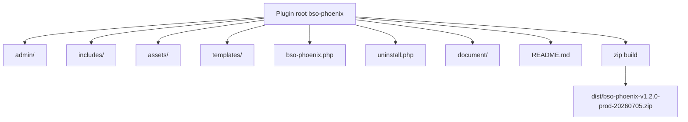
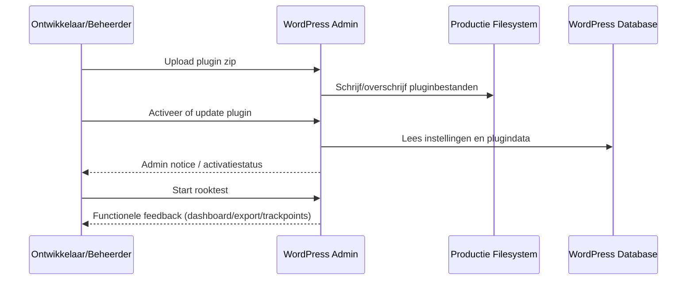
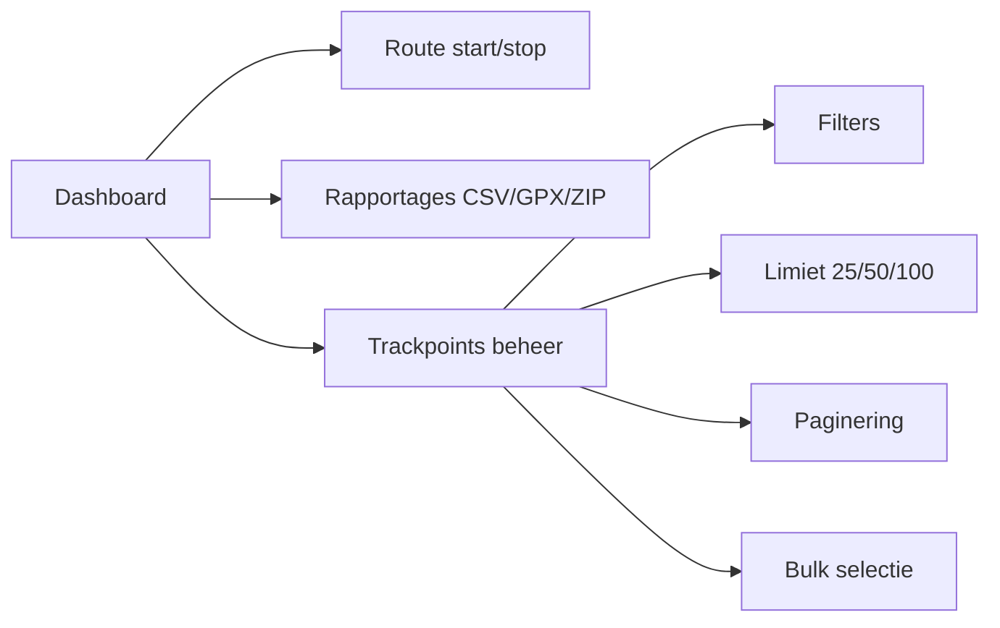
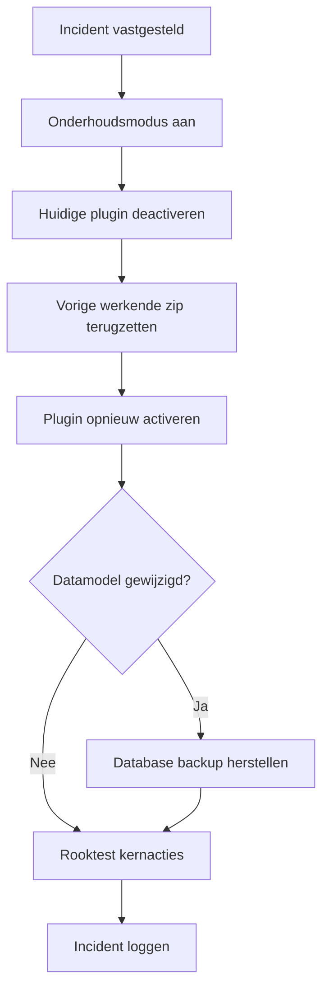
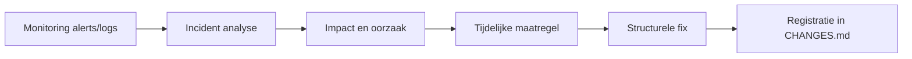

# Runbook - Beheer en Deploy (BSO Phoenix)

## Doel

Dit runbook beschrijft de standaard beheer- en uitrolstappen voor productie van de plugin BSO Phoenix.

## Scope

- voorbereiden van een release-zip
- deploy op WordPress productie
- functionele rooktest na deploy
- rollback in geval van incident

### Procesoverzicht

## Productie Artifact

- Huidig artifact: `dist/bso-phoenix-v1.2.0-prod-20260705.zip`
- Herkomst: opgebouwd vanuit de plugin root met uitsluiting van `.git` en `dist`

### Structuur artifact en bron

## Voorbereiding release

1. Controleer branch en werkboom:
   - `git branch --show-current`
   - `git status --short`
2. Draai minimale validatie:
   - `php -l bso-phoenix.php`
   - `php -l admin/class-phoenix-trackpoints-admin.php`
   - `php -l includes/class-phoenix-trip-service.php`
3. Bouw artifact:
   - `mkdir -p dist`
   - `zip -r "dist/bso-phoenix-vX.Y.Z-prod-YYYYMMDD.zip" . -x ".git/*" "dist/*" "*.DS_Store"`
4. Controleer artifactgrootte en naam:
   - `ls -lh dist`

## Deploy naar productie (WordPress)

1. Maak een backup van database en huidige pluginmap.
2. Zet de site kort in onderhoudsmodus.
3. Upload en installeer het zip-artifact via:
   - WordPress admin > Plugins > Nieuwe plugin > Plugin uploaden
4. Activeer of update de plugin.
5. Controleer of plugin actief is en geen PHP-fout geeft.
6. Haal onderhoudsmodus weg.

### Informatieflow tijdens deploy

## Rooktest na deploy

1. Open dashboard en controleer of hoofdscherm laadt.
2. Start en stop een testtocht (indien toegestaan in productie).
3. Open Rapportages en test export (CSV/GPX/ZIP).
4. Open Trackpoints beheer en controleer:
   - filters op trips en trackpoints
   - limietopties 25/50/100
   - paginering Vorige/Volgende
   - knoppen Alles selecteren / Selectie omkeren

### Rooktest structuur

## Monitoring eerste 30 minuten

- controleer WordPress debug log / PHP error log
- controleer admin notices op export- of validatiefouten
- controleer dat GPX-downloads geen 500 geven

## Rollback

1. Zet onderhoudsmodus aan.
2. Deactiveer huidige pluginversie.
3. Herstel vorige bekende werkende zip-versie.
4. Activeer plugin opnieuw.
5. Herstel eventueel database uit backup als datamodel is gewijzigd.
6. Verifieer dashboard en kernacties.

### Rollback proces

## Incident Logging

Registreer elk incident in het changes document met:

- datum/tijd
- impact
- root cause (indien bekend)
- tijdelijke maatregel
- structurele fix

### Informatieflow incident logging

