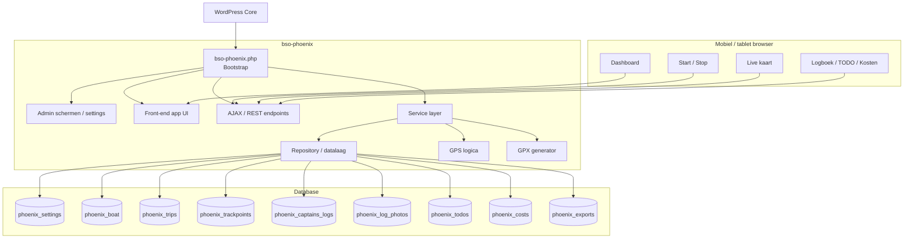
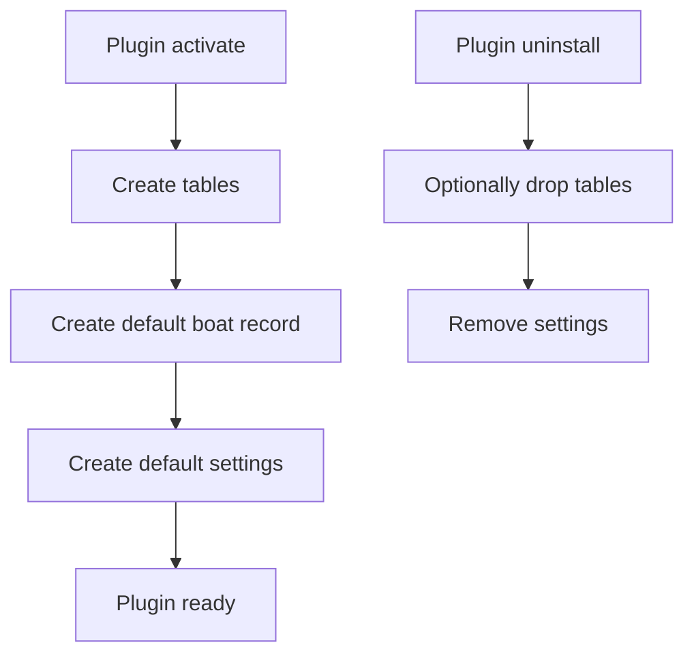
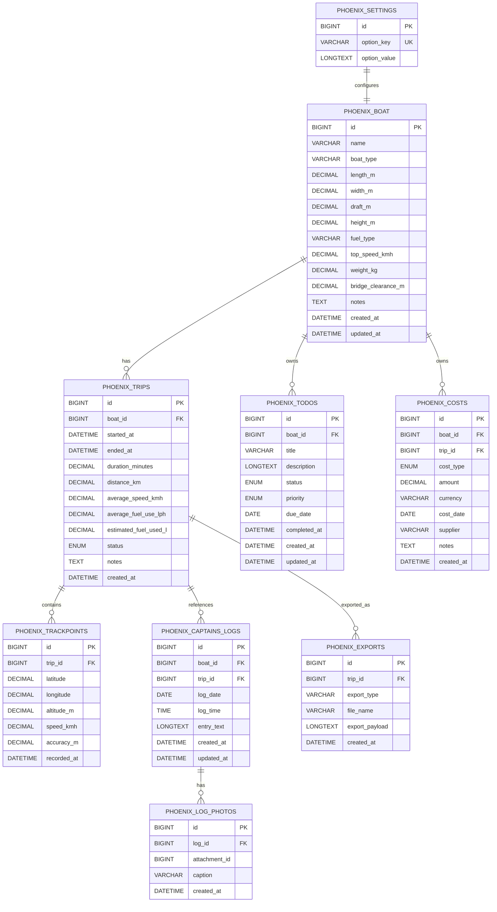
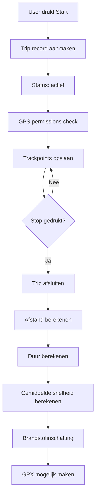
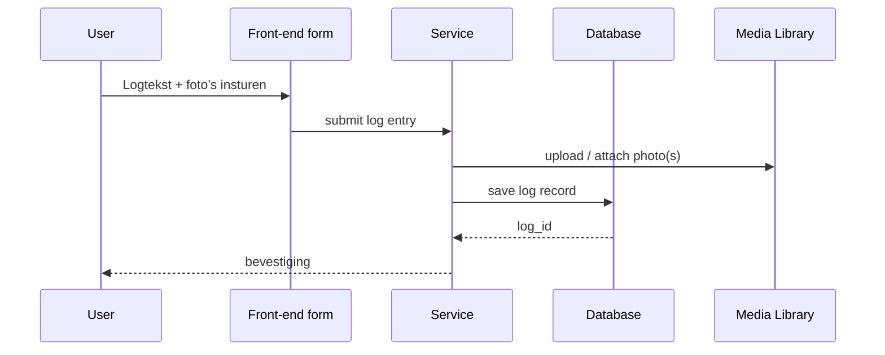
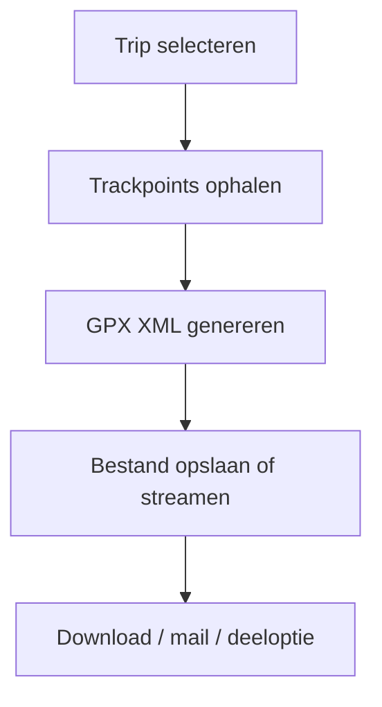
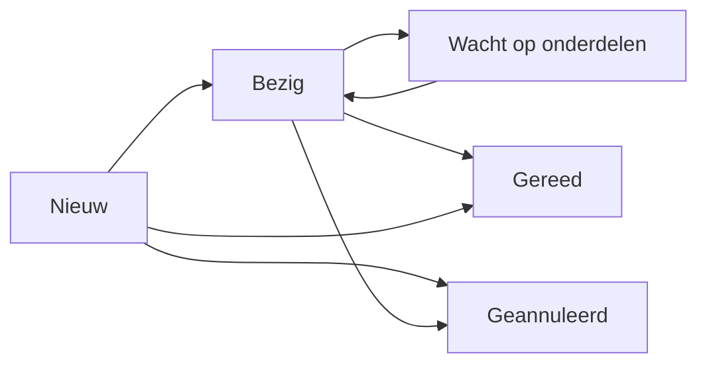
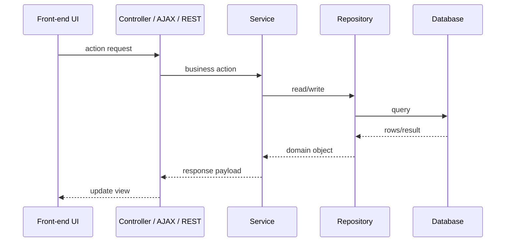

# Technisch Ontwerp - Phoenix Logboek App

**Plugin:** `bso-phoenix`  
**Versie:** 1.0.0  
**Auteur:** Byteway Software Ontwikkeling  
**Datum:** 3 juli 2026  
**Platform:** WordPress (PHP)

---

## Inhoudsopgave

1. [Doel en scope](#1-doel-en-scope)
2. [Architectuuroverzicht](#2-architectuuroverzicht)
3. [Bootstrap en lifecycle](#3-bootstrap-en-lifecycle)
4. [Datamodel en opslag](#4-datamodel-en-opslag)
5. [Bootprofiel en instellingen](#5-bootprofiel-en-instellingen)
6. [Route logging en GPS-verwerking](#6-route-logging-en-gps-verwerking)
7. [Captain's log en media](#7-captains-log-en-media)
8. [GPX generatie en delen](#8-gpx-generatie-en-delen)
9. [TODO, kosten en rapportage](#9-todo-kosten-en-rapportage)
10. [Dashboard en front-end interacties](#10-dashboard-en-front-end-interacties)
11. [API- en eventmodel](#11-api--en-eventmodel)
12. [Beveiliging, privacy en operationele aspecten](#12-beveiliging-privacy-en-operationele-aspecten)
13. [Known Implementation Caveats](#13-known-implementation-caveats)
14. [Roadmap](#14-roadmap)

---

## 1. Doel en scope

Dit technisch ontwerp beschrijft de implementatie van de **Phoenix Logboek App** als WordPress-plugin. De plugin werkt als een app-achtige beheer- en logomgeving voor één motorboot: de Phoenix.

De technische focus ligt op:

- betrouwbare GPS-route logging vanaf mobiel of tablet
- opslag van tochtgegevens, logboekitems, foto’s, TODO’s en kosten
- dashboard met live status en routepreview
- genereren en delen van GPX-routes
- op WordPress gebaseerde autorisatie en opslag
### Problemen die de app technisch oplost

- inschatting van resterende brandstofvoorraad na elke tocht (basis voor tankplanning)
- verzameling van directe (bruggen, sluizen) en indirecte (gas, water) vaartkosten in een centraal register
- real-time en later bekijkbare kaartvisualisatie van routes en trackpoints
- exportfunctionaliteit van routes in standaardformaat (GPX) voor deling en validatie
- centraal beheer van onderhoudstaken en notities vastgelegd tijdens het varen
### Scope

Binnen scope:

- één bootprofiel
- start/stop route logging
- GPS trackpoint-opslag
- tochtregistratie en berekeningen
- daglogboek met media
- TODO-beheer
- kostenregistratie en rapportage
- route-extractie naar GPX
- dashboardweergave en front-end interacties

Buiten scope:

- meerdere boten
- nautische navigatie-automatisering
- externe cloudkoppelingen met routeplatforms
- geautomatiseerde tankpompintegratie

---

## 2. Architectuuroverzicht



### Ontwerpkeuze

Voor deze plugin worden **custom tables** gebruikt voor de kerngegevens. Reden:

- GPS trackpoints kunnen in grote aantallen worden opgeslagen
- routeverwerking en GPX-generatie vragen om snelle selecties
- relaties tussen tocht, punt, logboek en media zijn beter controleerbaar
- WP posts/meta zou voor deze datavorm minder efficiënt zijn

---

## 3. Bootstrap en lifecycle

### Bootstrap

De plugin-start bestaat uit:

- `bso-phoenix.php` als hoofdbootstrap
- registratie van constants en paden
- laden van tekstdomain
- registreren van activation / uninstall hooks
- laden van admin, front-end, service en repository lagen

### Lifecycle hooks

- activatie: aanmaken van tabellen en basisinstellingen
- deactivatie: geen destructieve acties
- uninstall: optioneel verwijderen van plugin-tabellen en instellingen



### Optioneel gedrag bij uninstall

De uninstall kan worden ingericht met een keuze:

- data behouden
- data volledig verwijderen

Voor een app met logboekhistorie is het logisch om data standaard te behouden totdat de beheerder expliciet verwijdering kiest.

---

## 4. Datamodel en opslag

### Datakluis

De plugin gebruikt een kernset tabellen voor de boot en alle gerelateerde records.



### Tabellen en functies

| Tabel | Functie |
|------|---------|
| `phoenix_settings` | Plugin-instellingen |
| `phoenix_boat` | Eén bootprofiel |
| `phoenix_trips` | Tochten en berekeningen |
| `phoenix_trackpoints` | GPS-punten per tocht |
| `phoenix_captains_logs` | Daglogboek |
| `phoenix_log_photos` | Media bij logboekitems |
| `phoenix_todos` | Onderhoud en taken |
| `phoenix_costs` | Kostenregistratie |
| `phoenix_exports` | GPX- en deelregistraties |

### Indexen

Aanbevolen indexen:

- `boat_id`
- `trip_id`
- `log_date`
- `status`
- `cost_type`
- `recorded_at`

Voor trackpoints is een samengestelde index op `trip_id, recorded_at` logisch.

---

## 5. Bootprofiel en instellingen

### Doel

Het bootprofiel bevat de vaste gegevens van de Phoenix en vormt de basis voor dashboard, route-informatie en berekeningen.

### Bootservice

De service-laag moet:

- het actieve bootrecord ophalen
- bootgegevens opslaan en bijwerken
- voorvertoning van technische bootinfo leveren

### Validatie

Alle bootvelden moeten worden gevalideerd:

- lengte, breedte, diepgang, hoogte en gewicht zijn numeriek
- topsnelheid en brandstofverbruik zijn numeriek
- bridge clearance moet minimaal gelijk zijn aan de ingestelde hoogte of expliciet als toelichting worden opgeslagen

### Instellingen

De plugininstellingen bevatten onder andere:

- standaard meeteenheden
- GPS poll interval
- brandstofberekeningsformule
- geofence / snelheid-drempel voor “varen actief”
- privacy-instellingen voor foto’s en delen

---

## 6. Route logging en GPS-verwerking

### Route flow



### GPS source

De GPS-data komt vanuit mobiel of tablet via browsergebaseerde locatievoorziening.

### Op te slaan routegegevens

- latitude / longitude
- tijdstip per punt
- optioneel altitude
- optioneel speed
- optioneel accuracy

### Voorbeeld GPS-log

Onderstaand voorbeeld illustreert een route zoals die uit de GPS-bron kan worden ingelezen en vervolgens als trackpoints kan worden opgeslagen.

```csv
latitude,longitude,name
53.1748,5.4146,Harlingen Noorderhaven
53.1812,5.4287,Tjerk Hiddessluis
53.1841,5.4950,Kiesterzijl
53.1835,5.5398,Franeker
53.1904,5.6425,Dronrijp
53.1941,5.7235,Deinum
53.1972,5.7410,Ritsumasyl
53.1785,5.8360,Waldmansdiep
53.1678,5.9185,Fonejacht
53.1492,5.8950,Wartena
53.1385,5.9220,De Alde Feanen
53.1302,5.9412,Earnewoude Haven
```

De punten in dit voorbeeld laten zien hoe een tocht met meerdere tussenstops of herkenbare locaties in de routeverwerking kan worden opgenomen. Voor de implementatie zijn vooral de latitude- en longitudewaarden relevant; de naam is bedoeld als menselijke toelichting en kan optioneel worden opgeslagen of afgeleid.

### Berekende waarden

- duur in minuten of uren
- totale afstand in kilometers
- gemiddelde snelheid in km/uur
- geschat brandstofverbruik

### Brandstofberekening

De plugin berekent het verbruik wanneer een gemiddeld verbruik is ingevuld, bijvoorbeeld liters per uur of liters per kilometer.

Aanbevolen berekening:

$$
\text{brandstofverbruik} = \text{duur in uren} \times \text{gemiddeld verbruik per uur}
$$

Wanneer verbruik per kilometer wordt gebruikt:

$$
\text{brandstofverbruik} = \text{afstand in km} \times \text{gemiddeld verbruik per km}
$$

---

## 7. Captain's log en media

### Logboekmodel

De captain's log is een dagboekachtige registratie van observaties, bijzonderheden en onderhoudsnotities.

### Relaties

- logboekitem kan gekoppeld zijn aan een tocht
- logboekitem kan meerdere foto’s bevatten
- elk logboekitem heeft datum en tijd
### Admin beheeracties

- bulk delete actie: alle logboekitems verwijderen met bevestigingsstap
- terugmelding aantal verwijderde items en bijbehorende foto's
### Media-opslag

Foto’s worden opgeslagen als WordPress-media-attachments en gekoppeld via het logboektabelrecord.

### Verwerking



---

## 8. GPX generatie en delen

### GPX generator

De GPX-generator zet trackpoints om naar een GPX-bestand of GPX-structuur.

### Functies

- volledige route exporteren
- route van vandaag exporteren
- deelroute exporteren op basis van geselecteerde tijd of punten
- delen via download
- delen via e-mail

### Validatie van geëxporteerde GPX-bestanden

Geëxporteerde GPX-bestanden kunnen online gevalideerd worden met de gratis dienst:
- https://gpx.studio/

### GPX-exportmodel



### In GPX op te nemen informatie

- starttijd
- eindtijd
- routepunten
- optionele naam van tocht
- optionele annotaties

---

## 9. TODO, kosten en rapportage

### TODO-module

De TODO-module ondersteunt onderhoudsbeheer en planning.

#### Veldenset TODO

| Veld | Omschrijving |
|------|--------------|
| Titel | Korte omschrijving van de taak |
| Omschrijving | Uitgebreide toelichting |
| Status | Vooraf gedefinieerde status |
| Prioriteit | Laag / normaal / hoog / urgent |
| Vervaldatum | Optioneel |
| Afgerond op | Datum afronding |

#### Statusflow



#### Admin beheeracties

- bulk delete actie: alle TODO-items verwijderen met bevestigingsstap
- terugmelding aantal verwijderde taken

### Kostenmodule

De kostenmodule ondersteunt:

- kosten van varen
- onderhoudskosten
- kosten van onderhoudsartikelen
- overige kosten

#### Kostenregistratie

| Veld | Omschrijving |
|------|--------------|
| Categorie | Varen, onderhoud, onderdelen, overige |
| Bedrag | Geldbedrag |
| Datum | Boekingsdatum |
| Koppeling | Optioneel aan tocht |
| Leverancier | Optionele leverancier of nota |
| Opmerking | Vrije toelichting |
#### Registratieregel voor meerdere kosten per dag

Meerdere kostenposten van hetzelfde type mogen op dezelfde datum worden opgeslagen.
Duplicatie wordt alleen voorkomen bij echte dubbele submit (dezelfde actie direct herhaald), niet op basis van categorie+datum combinatie.
### Rapportages

De rapportagelaag berekent en toont onder andere:

- route van vandaag
- route van een geselecteerde periode
- totale duur
- totale afstand
- gemiddeld verbruik
- totale brandstofkosten
- totale onderhoudskosten

---

## 10. Dashboard en front-end interacties

### Dashboard

Het dashboard moet in één oogopslag de status van de boot tonen:

- vaart de boot nu of niet
- is er een actieve tocht
- wanneer is de laatste update ontvangen
- is tanken waarschijnlijk nodig
- live preview van de GPX-kaart met schakeloptie tussen compacte weergave en schermvullende view
- snelle knoppen voor Start, Stop en Logboek

### Live gedrag

Tijdens een actieve tocht moet de interface:

- routepunt-updates verwerken
- kaart direct laten meegroeien
- snelheid en duur actualiseren
- status tonen als “actief”

### Voorfront-end componenten

- startknop
- stopknop
- kaartpaneel
- logboekpaneel
- TODO-paneel
- kostenpaneel
- overzichtspaneel

---

## 11. API- en eventmodel

### Interne API-lagen

De plugin gebruikt bij voorkeur een service- en repositorylaag met een centrale controllerlaag.

#### Mogelijke endpoints

- `start_trip`
- `stop_trip`
- `append_trackpoint`
- `save_captains_log`
- `add_todo`
- `update_todo_status`
- `add_cost`
- `generate_gpx`

### Eventflow



### Keuze voor transport

Voor de app-ervaring is een combinatie van AJAX of REST-achtige calls geschikt. De uiteindelijke implementatie moet kiezen voor één consistente transportlaag.

---

## 12. Beveiliging, privacy en operationele aspecten

### Beveiliging

- capability checks op beheeracties
- nonce-checks op mutaties
- sanitisatie van tekst, kosten en GPS-invoer
- uploadrestricties voor foto’s
- gecontroleerde GPX-downloads

### Privacy

Omdat de app route- en locatiegegevens opslaat, is privacy belangrijk:

- locatiegegevens alleen voor geautoriseerde gebruikers
- foto’s alleen voor bevoegde rollen
- export en delen expliciet activeren

### Operationeel

- GPS-punten kunnen snel oplopen in volume
- daarom zijn aparte trackpoint-tabellen nodig
- kaartweergave moet efficient herladen
- tochtdata moet snel filterbaar zijn op datum of status

---

## 13. Known Implementation Caveats

### 13.1 GPS vraagt om stabiele browserpermissies

Browserlocatie werkt alleen als de gebruiker toestemming geeft.

Impact:

- logging kan niet starten zonder permissie
- duidelijke foutmelding is nodig

### 13.2 Trackpoint-volume groeit snel

Bij actieve logging kunnen veel trackpoints worden opgeslagen.

Impact:

- goede indexering is noodzakelijk
- grote queries moeten beperkt worden tot de relevante tocht

### 13.3 GPX en kaartgeneratie zijn render-intensief

Het genereren van een kaart of export kan zwaar zijn bij lange routes.

Impact:

- export moet asynchroon of gestreamd kunnen worden
- kaart moet slim samengevat of getrapt worden geladen

### 13.4 Geen multi-boot support

De plugin is bewust op één boot ingericht.

Impact:

- eenvoudiger beheer
- minder complexe relaties
- minder UI-keuzes voor de gebruiker

---

## 14. Roadmap

### Fase 1 - Basis

1. Bootprofiel en instellingen
2. Activatie en tabellen
3. Start/stop trip logging
4. Trackpoint-opslag

### Fase 2 - Logboek en data

1. Captain's log
2. Foto-upload
3. TODO-module
4. Kostenregistratie

### Fase 3 - Inzicht en export

1. GPX-generator
2. Dashboard met live preview
3. Rapportages voor vandaag en periode
4. Delen via download en e-mail

### Fase 4 - Hardening

1. prestaties optimaliseren
2. extra validatie van GPS en media
3. privacy- en toegangsregels aanscherpen
4. testautomatisering toevoegen

---

*Gegenereerd op 3 juli 2026 - Technisch Ontwerp v1.0.0*
